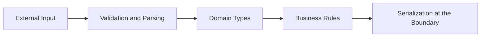

# Always Use Domain-Specific Types for Primitives

Most software systems do not fail because `string`, `number`, or `boolean` are bad tools. They fail because those tools are asked to carry domain meaning that the code never makes explicit.

A `string` might be an email address, a country code, a customer id, a discount code, or an ISO timestamp. A `number` might be money, a quantity, a retry count, or a percentage. The machine is satisfied because all of them are valid primitives. The business is not, because those values are not interchangeable.

That gap is where confusion enters the system.

## Primitives Store Data, Types Carry Meaning

A primitive tells you how something is represented in memory. It does not tell you what the value is allowed to mean inside the business domain.

If a function accepts this:

```ts
function createAccount(id: string, email: string, retryCount: number) {}
```

the compiler knows almost nothing useful about your intent. Any string can be passed for `id` or `email`. Any number can be passed for `retryCount`, including `-10`.

Now compare it with this:

```ts
type CustomerId = string & { readonly brand: 'CustomerId' };
type EmailAddress = string & { readonly brand: 'EmailAddress' };
type RetryCount = number & { readonly brand: 'RetryCount' };

function createAccount(id: CustomerId, email: EmailAddress, retryCount: RetryCount) {}
```

The underlying storage is still primitive, but the code now exposes the domain. That improves review quality, reduces accidental mixups, and makes future change much safer.

## Primitive Obsession Is Really Meaning Obsession

Teams often describe this problem as primitive obsession. The deeper problem is not stylistic. It is that the code keeps losing meaning at exactly the places where meaning matters most.

You can usually spot it when:

- multiple parameters have the same primitive type but different semantics
- validation rules are repeated near call sites
- ids from different contexts can be passed into the same function
- money, percentages, and quantities are all represented as bare numbers
- boolean flags start to encode business modes rather than simple toggles

These are all signs that the domain model is too weak for the system it is trying to describe.

## Domain Types Improve Boundaries

The biggest benefit of domain-specific primitive types is not just local correctness. It is better boundaries.



The boundary is where raw primitives should be parsed, validated, and converted into domain values. Once data crosses into the core of the system, it should stop behaving like an anonymous `string` or `number`.

That creates a simple rule:

- parse primitives at the edge
- use domain types in the core
- serialize back to primitives only when leaving the system

This separation makes it much harder for invalid or ambiguous values to drift through internal code.

> Do you think it's an imaginary situation? [Read](https://www.simscale.com/blog/nasa-mars-climate-orbiter-metric/) [about](https://solarsystem.nasa.gov/missions/mars-climate-orbiter/in-depth/) how NASA lost one of its spacecrafts (**Mars Climate Orbiter**) due to a metric math mistake on September 23, 1999, which resulted in a costly loss of $125 million ($229M in today's currency). In short, the mission was unsuccessful due to a navigation error caused by a failure to translate English units to metric.

## The Compiler Should Help With Illegal States

One of the most useful design goals in software is to make illegal states difficult or impossible to represent.

A primitive-heavy model does the opposite. It expands the number of values the system can accept while leaving validation as a social convention.

For example:

```ts
type Percentage = number & { readonly brand: 'Percentage' };

function makePercentage(value: number): Percentage {
  if (value < 0 || value > 100) {
    throw new Error('Percentage must be between 0 and 100');
  }

  return value as Percentage;
}
```

After the value is constructed, downstream code no longer has to wonder whether `137` accidentally slipped in. The validation becomes part of the type’s entry point, not an informal hope scattered across the call graph.

## Use Types Where Confusion Is Expensive

This does not mean every primitive deserves a wrapper. The point is not ceremony. The point is precision.

Good candidates for domain-specific types are:

- identifiers
- money and currency amounts
- email addresses, phone numbers, and URLs
- percentages, rates, and quantities
- bounded counters or scores
- date ranges and domain timestamps

Weak candidates are usually values with no business ambiguity and no rules beyond simple representation.

The test is straightforward: if swapping two values of the same primitive type would be a real bug, they should probably not share the same type in your domain model.

## Domain Types Also Improve APIs

APIs become easier to evolve when their signatures express intent clearly. A function that accepts `CustomerId` is easier to use correctly than one that accepts `string`. A service returning `EmailAddress | null` communicates more than one returning `string | null`.

This matters even more in larger systems, because types become part of team communication. They document expectations in a way comments rarely sustain over time.

Good domain types help with:

- onboarding, because the vocabulary is embedded in the code
- refactoring, because type errors expose invalid assumptions
- code review, because intent is visible at call sites
- testing, because fixtures are shaped by real business concepts

That is a compounding advantage, not a local one.

## The Goal Is Not Fancy Types

It is possible to overdo this. If every line requires a new wrapper or factory, the model can become noisy and harder to use. The solution is not to abandon domain types. It is to introduce them where they remove ambiguity rather than where they merely add formality.

A healthy rule is:

1. start with the places where confusion already caused bugs
2. promote repeated validation rules into constructors or parsers
3. make domain names visible in public APIs first
4. keep the conversion cost near boundaries, not everywhere

This keeps the model practical.

## Conclusion

Bare primitives are cheap to write and expensive to trust. Domain-specific types invert that trade-off. They ask for a bit more intention up front so the rest of the system can be simpler, safer, and easier to read.

That is usually the right deal. If two values mean different things in the business, they should not look identical in the code.
